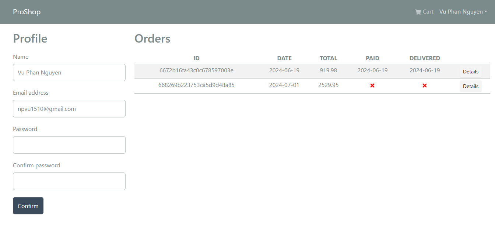
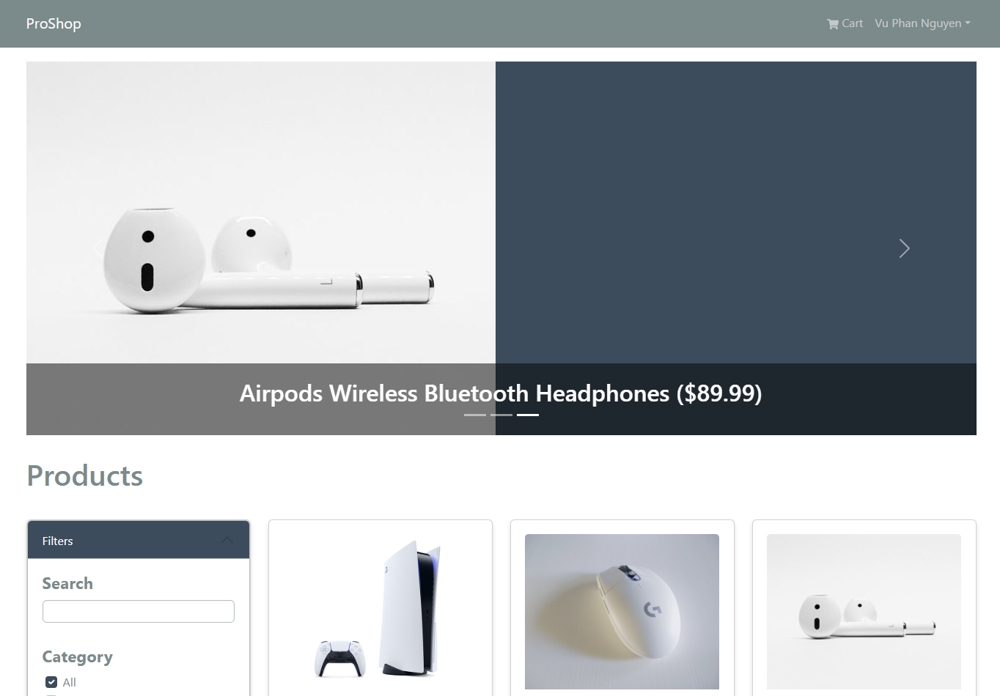
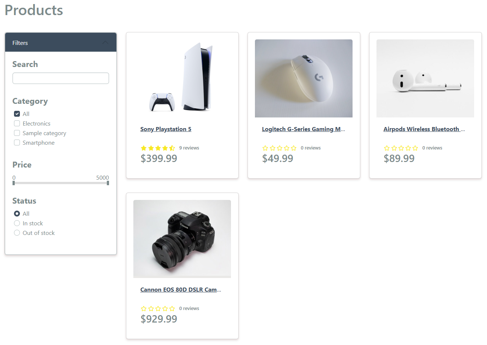
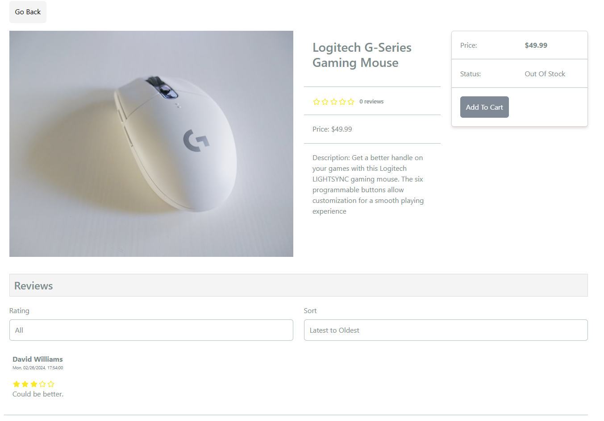
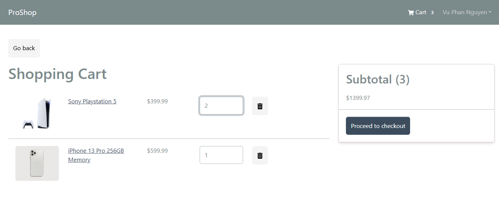
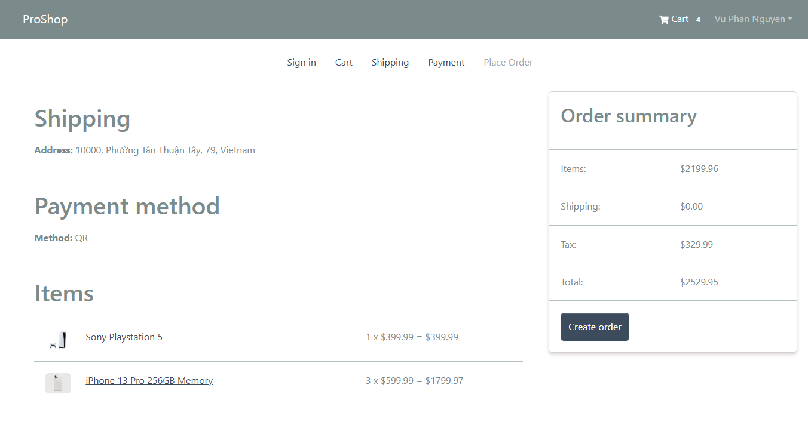
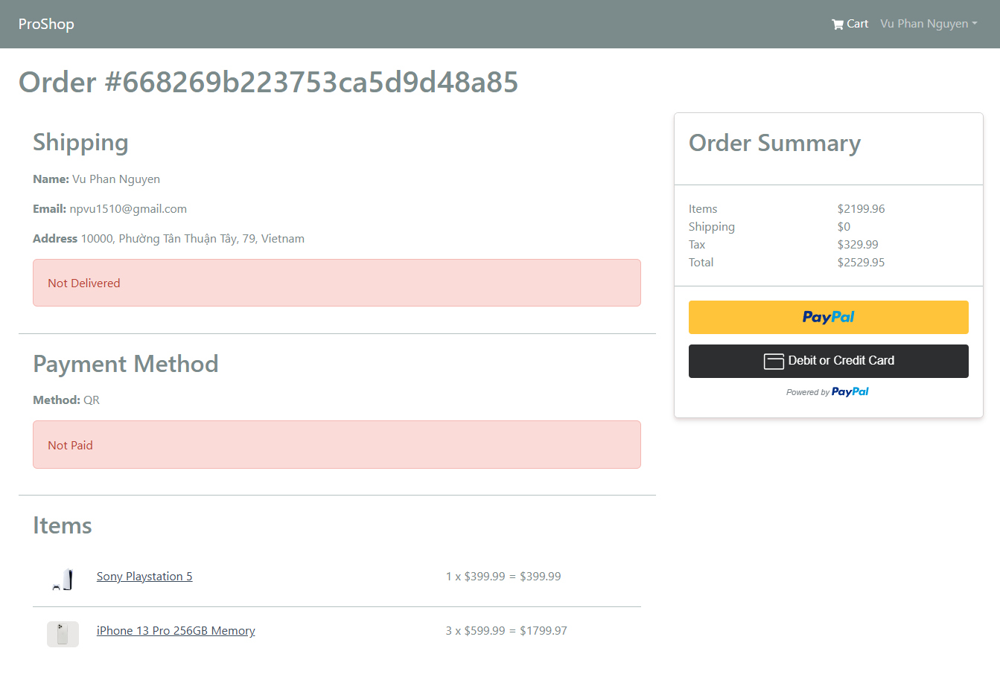
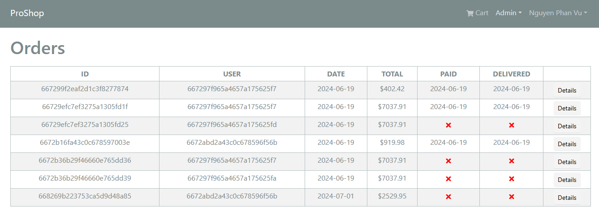
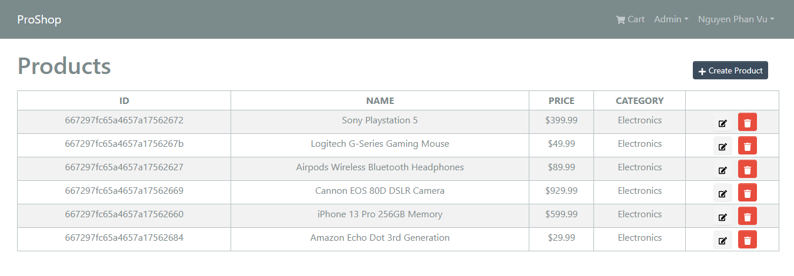

# Proshop

- A comprehensive e-commerce application built with the MERN stack. This project includes features such as user authentication, product browsing with advanced filtering, PayPal payment integration, and more.
- [Demo and explain](https://youtu.be/q0wX_nvp-sw
)

## Features

### User Features

- Sign up and Sign in
- Token-based authentication with refresh tokens (ensuring only one request fetches a new token while others wait)
- Profile and password update
- Browse products with filters by price range, category (multiple selection), name, and stock status (in stock/out of stock)
- Add products to cart and checkout with PayPal
- View order status
- Review purchased products, view, filter, and sort reviews

### Admin Features

- Manage orders: view, delete, update, and mark as delivered
- Manage products: view, delete, update
- Manage users: view, delete, update, change roles (user/admin)

## Technologies

- **MERN Stack**
  - **Frontend:** React, Redux Toolkit, React Bootstrap, RTK Query
  - **Backend:** Node.js, Express, MongoDB (Mongoose)
- **Authentication**
  - JWT for authentication
  - Redis for blacklisting refresh tokens
- **User Interface**
  - React Bootstrap for styling
  - Compound Components
- **State Management**
  - Redux Toolkit
  - RTK Query for data fetching and caching
- **Payment Integration**
  - PayPal for secure payments
- **Database Transactions**
  - Mongoose Transactions for stock synchronization
- **Additional Features**
  - Pagination, sorting, and filtering with debounce

## Screenshots
### Authentication Pages


### Profile Page


### Home Page


### Product Page


### Product Detail Page


### Cart Page


### Place Order Page


### Order Detail Page


### Admin Order Management Page


### Admin Product Management Page



## Project Setup

1. Clone the repository:
   ```sh
   git clone https://github.com/npvu1510/proshop.git
   
2. Install dependencies:
   ```sh
   npm install
   
3. Set up environment variables:
   Create a `.env` file in the root directory and add the necessary environment variables. An example `.env` file:
   ```env
   NODE_ENV = development
   PORT = 5000

   # MONGO
   MONGO_URI = your_mongodb_uri

   # TOKEN
   SECRET_KEY = your_secret_key
   REFRESH_SECRET_KEY = your_refresh_secret_key

   # PAYPAL
   PAYPAL_URL = https://api-m.sandbox.paypal.com
   PAYPAL_GET_TOKEN_ENDPOINT = /v1/oauth2/token
   PAYPAL_SHOW_ORDER_ENDPOINT = /v2/checkout/orders
   PAYPAL_CLIENT_ID = your_paypal_client_id
   PAYPAL_SECRET_KEY = your_paypal_secret_key

4. Start development server:
   ```sh
   npm run server
   
5. Start client:
   ```sh
   npm run client
